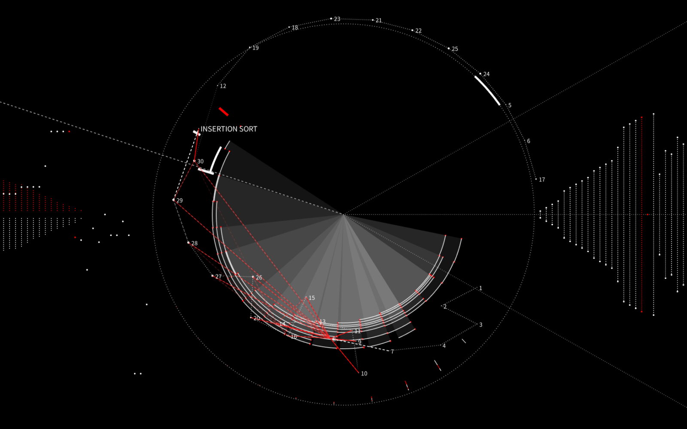
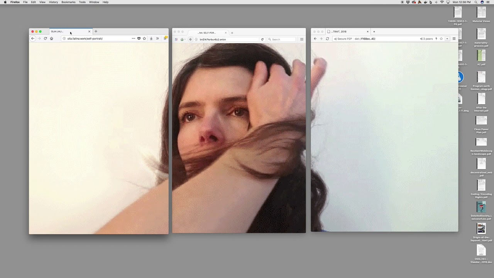

#### Mind Map

#### Areas of Interest
* Computer Algorithms
* Media Studies
* User-generated Content
* Social Media Platform
#### Open Questions
* What can algorithms do?
* What are the changes in the roles of the algorithm and the platform?
* What are the driving forces behind digital platform development?
* What are the current issues that being raised globally?
#### Precedents
1. [Sorting – Visualisation, sortification and sonification of an algorithm](http://www.creativeapplications.net/processing/sorting-visualisation-sortification-and-sonification-of-an-algorithm/)

    *Sorting* is an algorithm visualization and sonification. It visualized the features of sorting and made the algorithms of sorting audible. 

    

2. [Ubisoft - Predictive World](https://www.stinkstudios.com/work/ubisoft-predictive-world)

    *Ubisoft - Predictive World* is an interactive digital experience that reveals how user's digital footprint impacts their personal profiles.

    

3. [Self - Portrait](http://olia.lialina.work/)

    This is a guided experience for the audience to make Olia Lialina's self protrait with three browsers: Firefox, Tor and Beaker.

    

4. [AutocompleteMe](https://chrome.google.com/webstore/detail/autocompleteme/eogcdcehlimjeoppmelejmniabchmfgl)

    *AutocompleteMe* is a Chrome extension that shows the audience random searches with funny autocomplete suggestions.

    

#### Secondary Textual Resources
Felix Stalder 
> lecturer in the Theory of the Media Society at the Zurich University of Arts. His work focusses on the intersection of cultural, political and technological dynamics. He is a founder of Openflows, a long-time moderator of the nettime mailing list, and a board member of the Institute for new Culture Technologies/t0 in Vienna. With the institute, co-organized, among others, the Deep Search conference (2008), and the World Information City conferences, Bangalore (2005) and Paris (2009). He has published most recently Open Cultures and the Nature of Networks (2005), Manuel Castells and the Theory of the Network Society (2006), and, as co-editor, Media Arts Zurich (2008).

Lev Manovich
> Professor am Institut für Bildende Kunst an der University of California, San Diego, Kodirektor der Software Studies Initiative am California Institute for Telecommmunications and Information Technology (Calit2), Gastprofessor am
Goldsmith College, University of London, an der De Montfort University (GB) und am College of Fine Arts, University of New South Wales (Sydney); Buchveröffentlichungen u.a.: Software Takes Command (veröffentlicht unter CC-Lizenz, 2008), Navigating the Database (MIT Press 2005) und The Language of New Media (MIT Press, 2001), das als die „anregendste und umfassendste Mediengeschichte seit Marshall McLuhan“ bezeichnet wurde.