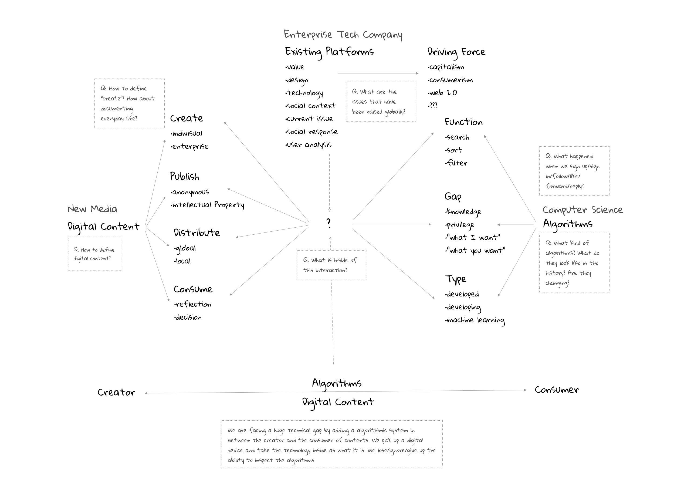
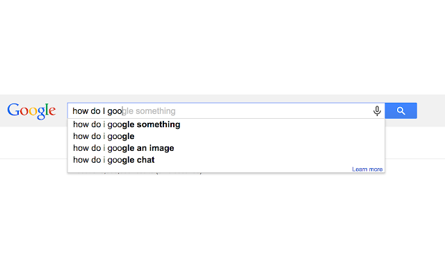

#### Mind Map

#### Areas of Interest
* Computer Algorithms
* Media Studies
* User-generated Content
* Social Media Platform
#### Open Questions
* What can algorithms do?
* What are the changes in the roles of the algorithm and the platform?
* What are the driving forces behind digital platform development?
* What are the current issues that being raised globally?
#### Precedents
1. [Sorting – Visualisation, sortification and sonification of an algorithm](http://www.creativeapplications.net/processing/sorting-visualisation-sortification-and-sonification-of-an-algorithm/)

    *Sorting* is an algorithm visualization and sonification. It visualized the features of sorting and made the algorithms of sorting audible. 

    

2. [Ubisoft - Predictive World](https://www.stinkstudios.com/work/ubisoft-predictive-world)

    *Ubisoft - Predictive World* is an interactive digital experience that reveals how user's digital footprint impacts their personal profiles.

    

3. [Self - Portrait](http://olia.lialina.work/)

    This is a guided experience for the audience to make Olia Lialina's self portrait with three browsers: Firefox, Tor and Beaker.

    

4. [AutocompleteMe](https://chrome.google.com/webstore/detail/autocompleteme/eogcdcehlimjeoppmelejmniabchmfgl)

    *AutocompleteMe* is a Chrome extension that shows the audience random searches with funny autocomplete suggestions.

    

5. [Progressive Growing of GANs for Improved Quality, Stability, and Variation](https://www.youtube.com/watch?v=G06dEcZ-QTg)

    *The publisher trained a Generative Adversarial Network using 30,000 celebrity photos.*

    

#### Secondary Textual Resources
Cormen, Thomas H. Algorithms Unlocked. Cambridge: MIT Press, 2013.

Kelly, Kevin. What Technology Wants. New York: Penguin Books, 2011.

"Lev Manovich." Lev Manovich - Home. Accessed September 10, 2018. http://manovich.net/index.php/projects/instagram-and-contemporary-image.

Taylor, Astra. The Peoples Platform: Taking Back Power and Culture in the Digital Age. New York, NY: Metropolitan Books, 2014.

#### Faculty Resources
Lev Manovich
> an author of books on new media theory, professor of Computer Science at the City University of New York, Graduate Center, U.S. and visiting professor at European Graduate School in Saas-Fee, Switzerland. Manovich's research and teaching focuses on digital humanities, social computing, new media art and theory, and software studies.

Felix Stalder 
> lecturer in the Theory of the Media Society at the Zurich University of Arts. His work focusses on the intersection of cultural, political and technological dynamics. He is a founder of Openflows, a long-time moderator of the nettime mailing list, and a board member of the Institute for new Culture Technologies/t0 in Vienna.

Fei Liu
> a New York-based Chinese designer, artist, writer, and DJ exploring digital empathy and the narrative potential of interfaces. She is an adjunct professor at Parsons MFA Design and Technology and previously a Researcher in Residence at NEW INC, and a Digital Solitude fellow at Akademie Schloss Solitude in Stuttgart, Germany.