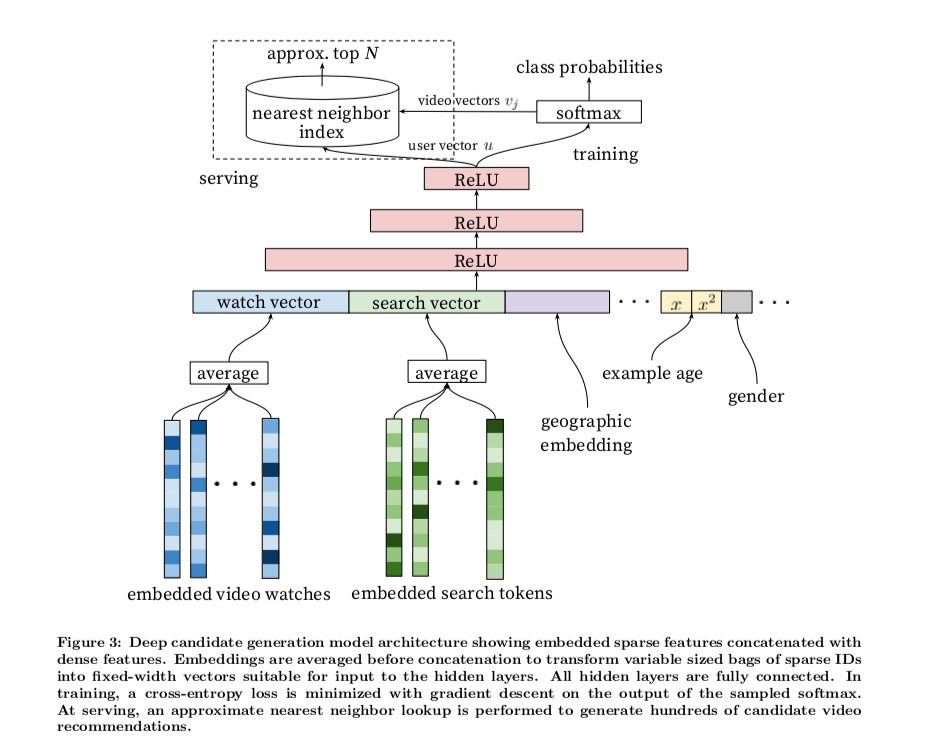

#### Research Method Candidates
* Brainstorming
* Flow Analysis
* Character Profile
* Error Analysis
* Long-Range Forecasts
#### Extended Resources
[Anatomy of AI](https://anatomyof.ai)

[Visualization for AI Explainability](https://visxai.io)

[Publication from Google](https://ai.google/research/pubs/)

[AI system uses transparent, human-like reasoning to solve problems](http://news.mit.edu/2018/mit-lincoln-laboratory-ai-system-solves-problems-through-human-reasoning-0911)

[Experimental evidence of massive-scale emotional contagion through social networks in PNAS](http://www.pnas.org/content/pnas/111/24/8788.full.pdf)

[Algorithm of Oppression](https://nyupress.org/books/9781479837243/)

> The political nature of search demonstrates how algorithms are a fundamental invention of computer scientists who are human beings - and code is a language full of meaning and applied in varying ways to different types of information.

> Helen Nissenbaum, aniversity, has written with Lucas Introna, a professor of organization, technology, and ethics at the Lancaster University Management School, about how search engines bias information toward the most powerful online. Their work was corroborated by Alejandro Diaz, who wrote his dissertation at Stanford on sociopolitical bias in Google's products. Kate Crawford and Tarleton Gillespie, two researchers at Microsoft Resear professor of media, culture, and communication and computer science at New York Uch New England, have written extensively about algorithmic bias, and Crawford recently coorganized a summit with the White House and New York University for academics, industry, and activists concerned with the social impact of artificial intelligence in society. 

[The Black Box Society](http://www.hup.harvard.edu/catalog.php?isbn=9780674368279)

YouTube's top creators are burning out and breaking down

    https://www.polygon.com/2018/6/1/17413542/burnout-mental-health-awareness-youtube-elle-mills-el-rubius-bobby-burns-pewdiepie

    https://www.tubefilter.com/2016/06/23/reverse-engineering-youtube-algorithm/

    https://www.tubefilter.com/2017/02/16/youtube-algorithm-reverse-engineering-part-ii/

    https://ai.google/research/pubs/pub45530

> YouTube promotional algorithms (Recommended, Suggested, Related, Search, MetaScore, etc.) simply as "the YouTube algorithm"

> Watchtime is a combination of: views, view duration, session starts, upload frequency, session duration, session ends. 

> 

Can Mark Zuckerberg Fix Facebook Before It Breaks Democracy?

    https://www.newyorker.com/magazine/2018/09/17/can-mark-zuckerberg-fix-facebook-before-it-breaks-democracy

    https://www.theguardian.com/news/2017/may/21/facebook-moderators-quick-guide-job-challenges 

> As Facebook grew, Zuckerberg and his executives adopted a core belief: even if people criticized your decisions, they would eventually come around.

> "We compete with Twitter as a broadcast medium; we compete with Snapchat as a broadcast medium; we do messaging, and iMessage is default-installed on every iPhone."

> Zuckerberg sought to avoid banning users, preferring to be a “platform for all ideas.” But he needed to prevent Facebook from becoming a swamp of hoaxes and abuse. His solution was to ban “hate speech” and impose lesser punishments for “misinformation,” a broad category that ranged from crude deceptions to simple mistakes.

#### Notes
The over-arching questions I am interested in 
1. How algorithm, as an invention of humans, can be used to change humans mentally and physically?
2. How is algorithm transparency being defined in policy and law in different countries/regions in the world?

