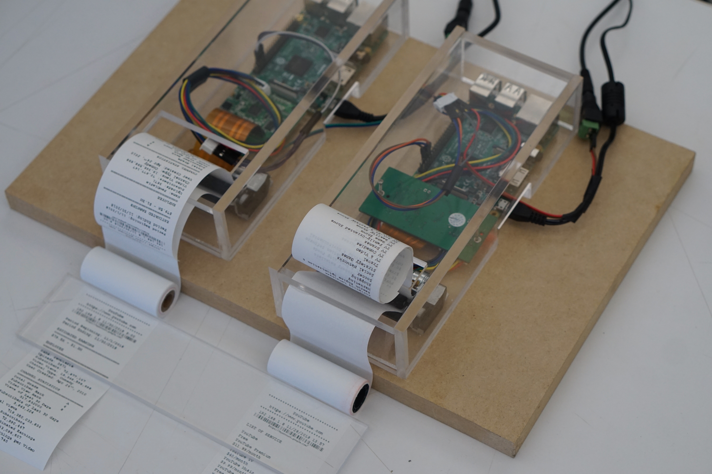

#### Abstract
Algorithms have been participating in the majority of the human's daily activities. More and more decision-making processes have been replaced by algorithm processing. However, little attention has been paid to regulating the behavior of an algorithm-controlled system as what being regulated of a human. This thesis project is looking at the impact of the algorithm to its direct users in the daily circumstances. More specifically, it is asking the question of how algorithm being transparent can make a difference to this impact. It experiments with bringing the dynamics inside the algorithm-controlled system outside and testing the experiences. The research also consists of the study of academic and legal responses to algorithmic transparency.

By choosing YouTube video publishing as the main focused area, and by presenting to both the viewers and creative content publishers of this platform, this project intends to model the unseen connections and dynamics inside of an iconic digital platform that closely connected with a large group of Internet users. To further manifest this idea, two networked thermal printers are constructed with Raspberry Pi, thermal printer guts, and acrylic boards, and two templates of receipts are designed and printed as if the digital contents within the black box are tangible. This opens the door for the audience to rethink about the process and question the ignorance. 

#### Thesis concept, questions, goal
This thesis project is looking at how the algorithmic transparency is affecting the everyday lives and what are the current academic and legal reactions addressing this problem. The goal of this project would be to present an experience that models the dynamics in an algorithm controlled system and the necessity of the algorithmic transparency.

#### Research
The research is based on the domain of algorithmic transparency and the sub-domains including algorithm-controlled systems, policy and ethics, security and Intellectual Property, and the main characteristics of the algorithm related to transparency. Algorithms are developed to solve a problem or complete a task. While we are enjoying the optimized world coming from algorithms, algorithms are controlling everything we see and do on the Internet. Digital platforms are producing "a harmonization of tastes" across the world. Facebook can conduct a study of emotional contagion based on a total number of 689.003 users. 80s Japanese enthusiasts can use YouTube's recommendation algorithm to share their interests and make "Plastic Love" an enormous hit. YouTube's top creators can work for the algorithms and have to claim burning out. 

Nicholas Diakopoulos and Michael Koliska coined the phrase and defined algorithmic transparency as "the disclosure of information about algorithms to enable monitoring, checking, criticism, or intervention by interested parties". Kate Crawford from AI Now Institute and Viadan Joler from Share Lab created an anatomical map of Amazon Echo. MIT Lincoln Laboratory is working on setting up a new standard for the algorithm to make the Artificial Intelligence system use human-like reasoning to solve problems. EU Commission relates data protection law as part of the rights of citizens. Regardless of where the data is processed and where the company is established, one has the right to obtain access to the personal data held, to request the decisions based on automated processing concerning, and to express the point of view and contest the decision. 

#### Audience & experience
The primary group of target audiences is the direct users of algorithms. In this case, they are the viewers and content publishers of video sharing platform. They are interested in user-generated contents on the Internet including video blogs, gaming videos, and instructional videos. They have limited knowledge of computer science. They have relatively heavier online activities but with less or no restriction on the user's privacy control. 

While being positioned in front of the physical installation, the audience may feel confused in the beginning. At the earlier stage of prototyping, users are encouraged to actively request for the disclosure of the mechanics by pressing a button. It was temporarily removed from the later prototypes. However, a trigger should be designed to help the audience better understand the event and context. The audience will be required to read the printed material carefully. 

#### Prototyping, testing, exploration through making

The first round of prototyping focuses on the idea of transactions. Three prototypes are created in the experiments. The physical part is consist of a soft-circuit button, a mini-size thermal receipt printer, the Arduino Uno, and several wires. The Arduino Uno has been pre-programmed through its IDE specifying a message describing the process and the goal of the YouTube recommendation algorithm. The audience can keep the paper as a personal copy of the record. The message on the paper is based on a reverse engineering article for the YouTube video publishers. Although it was written to explain the algorithms to the video publishers, it is a technical article that the wording would include "feature", "viewer session", "candidate generation filter" etc. To better comprehend these information, the message evolves into a form of receipt in the next prototype. The receipt is being presented as a proof of transactions when YouTube viewers access, a proof of the list of services, the personal data and cookies being collected from users, the Advertisement profiling of google account and Google's prediction of the owner's interests. By scanning the barcode, the audience will be directed to the Google accounts page. 

Receipt as a physical proof of transactions is proved to be effective. Receipt as a medium quickly sets up the connection between the convenience on the Internet and the "hidden payment". It also helps bring up the idea of the warranty, returns, exchange, special offers, and advertisements. Users, in general, are attracted by the analog form and the tangible experience. However, users can get to the concept without a more clear explanation. 

In the second round of prototyping, the characterization of content monetization is added to the process to break down the transactions further. Another version of receipt is presented to complete the story of video sharing. The workflow being visualized in the receipts now becomes the flow of the content publisher generating the contents, YouTube recommending the contents based on the viewer's profiles, personalization, and cookies, YouTube calculating the ad revenue, and the content publisher tracking the user statistics. 

The final physical form of the prototype uses a Raspberry Pi, thermal printer guts, wires and an acrylic box created by laser cutting. Wires and boards are exposed through the clear acrylic box to match the "transparency" theme. Raspberry Pi can talk to users' laptops or any other devices connected to the Internet, which provides additional freedom when further developing the functionalities. 

#### Technical production plan
Jan 14th - Jan 25th

Continue the literal experiments

Jan 28th - Feb 8th

Explore the physical forms, including size and materials

Feb 11th - Feb 22nd

Test with stakeholders and validate the form

Feb 25th - Mar 8th

Updating small details

Mar 11th - Mar 22nd

The second round of test

Mar 25th - Apr 2nd

Start the documentation