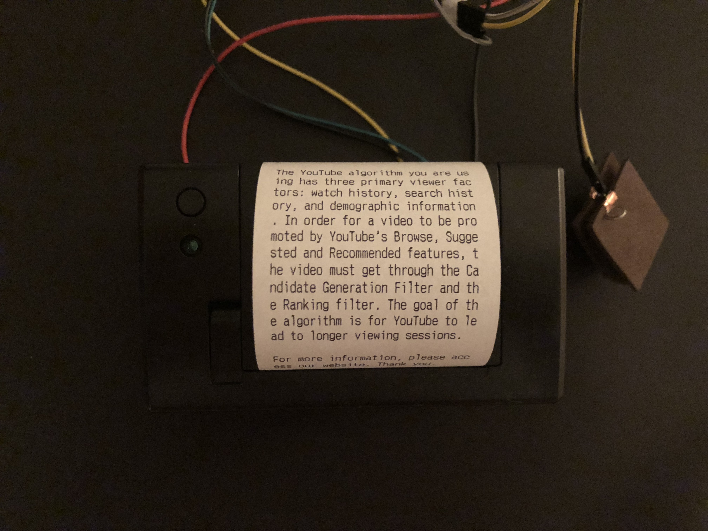

#### Concept
My thesis research is looking at how the algorithmic transparency is affecting the everyday lives and what are the current academic and legal reactions addressing this problem. 

Through the prototyping, I am planning to create an experience that models the dynamics in an algorithm controlled system and reflects the necessity of the algorithmic transparency.

#### Form

https://vimeo.com/294088503

#### Intention
Keywords: unboxing, dynamics

The first prototype is about creating a workflow that asks the audience to actively request for the disclosure of the mechanics within an algorithm-controlled system. Here I used a button, a mini thermal printer, and the YouTube video watching system. Once the audience presses the button, a piece of paper will be printed out stating the process and the goal of YouTube algorithms.

#### Material
- Soft circuit button
- Mini size thermal printer
- Arduino Uno
- Wires

#### Process + Mechanics
Arduino code [sketch_oct04a.ino](Code/sketch_oct04a.ino)

The Arduino will instruct the thermal printer to print a pre-programmed message when a digital input is detected.

#### Reflection
* Layer of information: There are three processes here. The audience uses YouTube as a context. The device prints the algorithmic information as the main process. In addition, the audience needs to comprehend the information. Should it be overwhelming? How does the data text work here? 
* Group of audience: Who would like to dig into the information and why does him/her press the button? For the audience who does not own the professional knowledge, how can I reorganize the information in order to close the gap?
* Physical setup: Why is it a printed material? What happened before using it or around it? Is it about the comprehensive process behind pressing a button on the web page? Should you solve a puzzle before you press the button (to make it even harder)?
* Receipt: The medium of thermal print paper makes it related with the receipt system. Is it intended? If more developed, can it be more like a proof of exchange, the evidence of transactions? Also think of coupons and policies printed on the receipt. Can it be used to revoke information collected as part of the service? What does it look like for a heavy YouTube user?
* The tone of the device: Is it designed to be funny? Should it appear at a more random place? Like a park which is not related with digital life at all.