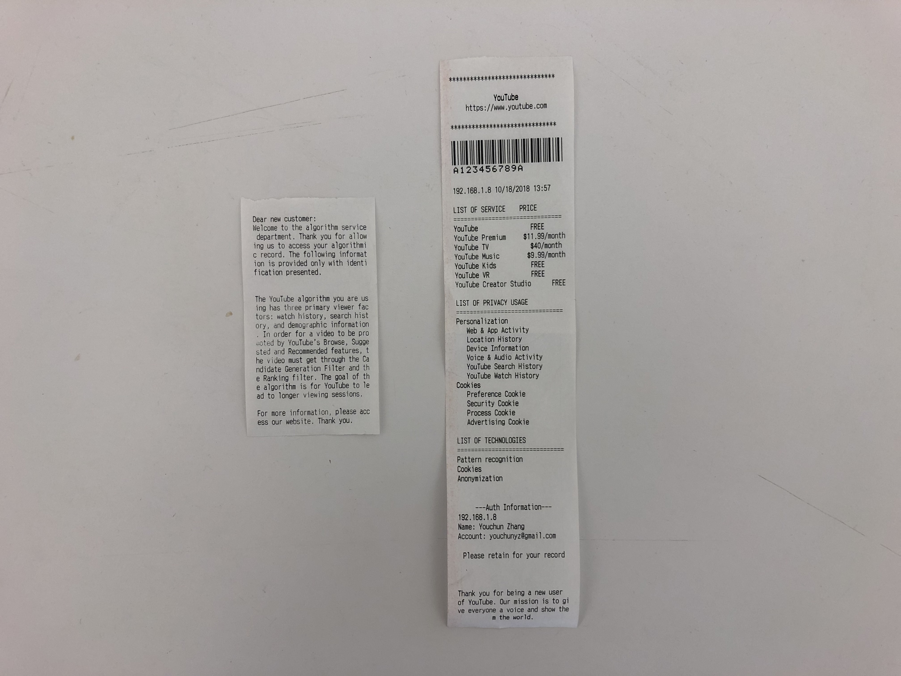
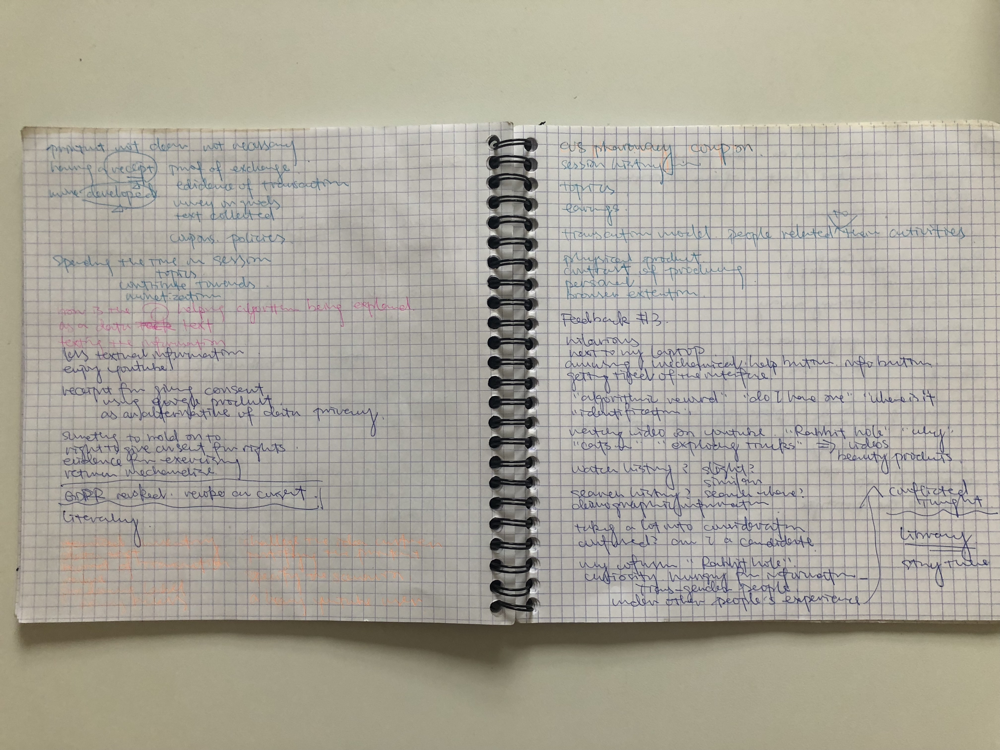
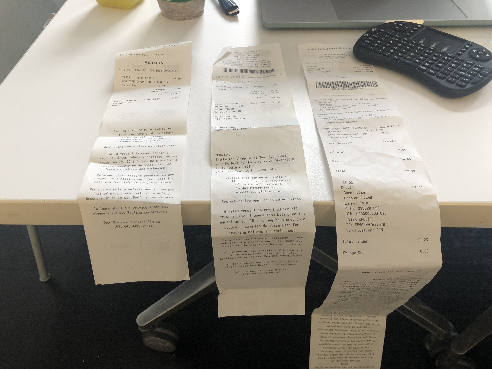

#### Form (2nd Iteration)

This is based on the feedback collected from the first prototype. It presents the list of services, the data being used, and the list of technologies with a format of receipt as the proof of transactions.  

#### Process + Mechanics
Arduino code [sketch_oct04a.ino](Code/sketch_oct18a.ino)

The Arduino will instruct the thermal printer to print a pre-programmed message with receipt-type styles.

#### User Test Questions
* How frequently do you use YouTube?
* What does the prototype make you think of?
* For what scenario?
* What information do you think is the most important? Why?

#### Reflection (from User Interview)
* Knowing that “Goal of algorithm” is to engage the viewer with a longer session is quite surprising
* The form is effective since you can "see it explicitly"
* "Access the service" with the "Specifics"
* Like the form of bill/receipt
* Feel like a "menu or index" pointing to a bigger information repository
* When asking why you think that you don't care enough: "made a compromise", “failure on me”, me "like the convenience", the algorithm is too "complicated"
* How to convey the "Layers of information" to an outsider (outside of DT)?
* How can we find the "threshold" that people would start to care?
* Contents affected by ranking and the recommendation system (from the creator)
* Maybe use the material design like language to convey the information correctly and effectively
* Effective - analog form
* Not effective enough - understanding the information

#### User Interview - With a Part-time Fashion Blogger
40 hours, 8 minutes: 40 hours is the average time that she spent on producing the content. The length of the video is usually about 8 mins. Her first one is a 15-min long one, but everyone suggests her that nobody will watch till the end. 

Why video becomes the most popular medium: The other media forms all have some kind of issues. For example, Instagram is being blocked by the government, while Weibo has the filtering and blocking issue which prevents the content to receive higher feedback without paying money.

What YouTube didn’t do becomes its strength: YouTube has a relatively fair and transparent filtering, meaning, it is more technical. 

Headline, limit/block, tags: Most of the headlines (in Weibo) are paid. It is not clear that how many viewers know about this fact. "Weibo cannot publish all contents from all the creators you follow to you", for a better experience and for more money. In addition, using existing forms (e.g. unboxing)make it more likely to be recommended.
