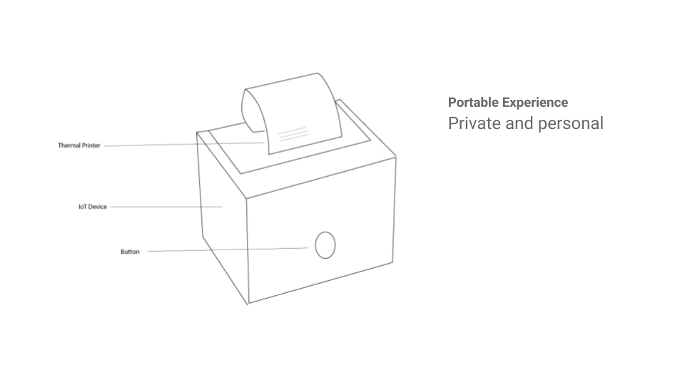

#### Form (3rd Iteration)

Three formats are being tested in this prototype. The first one tries to explain the details of search history by presenting the search queries from the data downloaded in my Google account. The second one elaborates the details of ad profiling of me based on my personal info and Google's estimation of my interests. 

Two possible forms of physical setup

#### Process
Arduino code [sketch_oct04a.ino](Code/sketch_nov01a.ino)

#### Reflection
* The connection between "Sleep no more" with recommendation algorithms
* The different treatment in Europe. Ad-supported digital publishers tried various approaches to convince ad blocker users to disable the software and pay for ad-free access to content. 
* Audience of paid service vs. free service
* Care about the breakdown of how much money earned from paying with your data. Quantify on user's side and their valuing. 
* Like the idea of translating the algorithm. We are getting things most people have no clue. Always think that the prediction did a bad job.
* Need to think about what are you hoping for, what are the takeaways.
* The labor of watching the ads, # of ads
