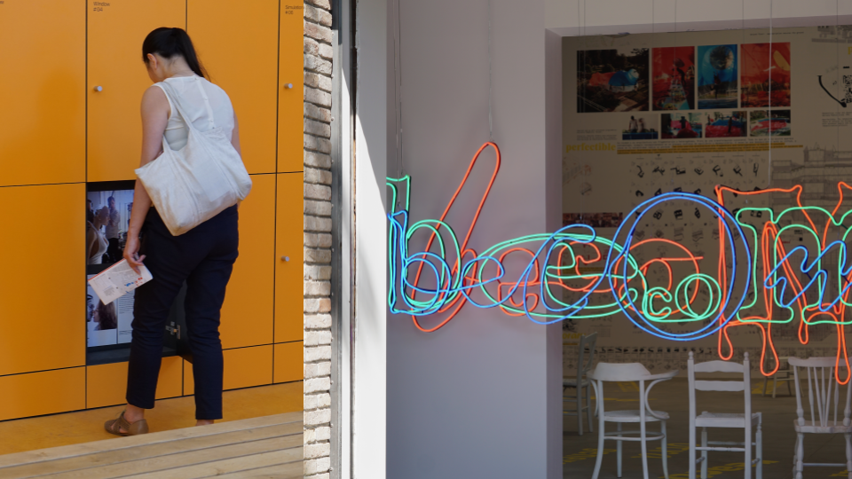
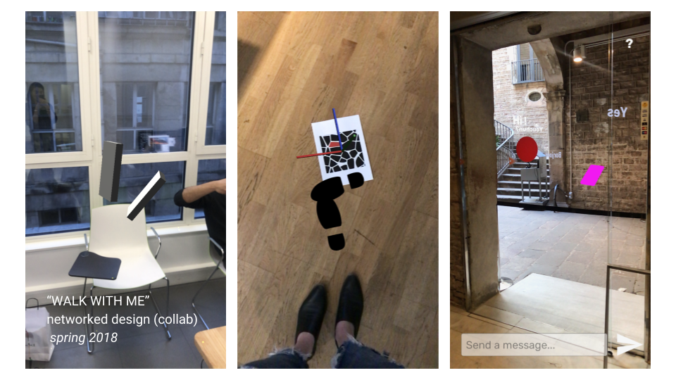

## Summer Research - Mind Wandering
#### Exploration
At the Venice Biennale 2018

Research Topics
* Content creation in the digital age
* Web 2.0
* Internet of Things
* Algorithms
* Instagram-ism

Readings

[The People's Platform: Taking Back Power and Culture in the Digital Age](https://www.amazon.com/Peoples-Platform-Taking-Culture-Digital/dp/0805093567)

[Facebook newsroom](https://newsroom.fb.com/news/2018/01/news-feed-fyi-bringing-people-closer-together/)

[The Second Index. Search Engines, Personalization and Surveillance](http://future-nonstop.org/c/609e8e4fa58aa59f8310958c4d2e4e37)

[Instagram and Contemporary Image](http://manovich.net/content/04-projects/148-instagram-and-contemporary-image/instagram_book_manovich.pdf)

[Welcome to Airspace](https://www.theverge.com/2016/8/3/12325104/airbnb-aesthetic-global-minimalism-startup-gentrification)

#### Collab 
[Walk With Me](https://github.com/nathanvogel/walk-with-me)

*Walk With Me* is an augmented reality application that visualizes the activities from two different places. By using telepresence, we want to give the audience the feeling of being in a combined space of both locations. It is a collaborative project between Parsons Paris and ECAL. 

We finished the first two design stages in the spring 2018 semester. We created a 2D footprint and an animation of footprint walking. The user will start the experience by entering a room or standing in an open space. The user will then be able to see the other users by tracking their footprints. 

The most important design point to solve is the interaction when two people "meet". We wanted to design the experience as a real-time shared action, to share some environmental information and help the audience feel more connected. Therefore, during the summer, we developed a messaging interface for the user to send immediate thought via the interface. The messages will be floating in the air of the combined space. We also added an on-boarding interface and an empty-room interface as an enhancement of the overall workflow. 

#### Notes - The Sting and Itch Metaphor

Quotes from *The People's Platform: Taking Back Power and Culture in the Digital Age*

> We are no longer passive consumers but active producers.

> People are beginning to recognize that Silicon Valley platitudes about "changing the world" and maxims like "don't be evil" are not enough to ensure that some of the biggest corporations on Earth will behave well.

> We will create and connect and the entrepreneurs will keep the cash.

Quotes from *Welcome to Airspace*

> Digital platforms like Foursquare are producing "a harmonization of tastes" across the world, Schwarzmann says. "It creates you going to the same place all over again."

I am hoping to answer these questions in the following research: What is in the process of content creation in the year 2018? How does information being created, published, and consumed? What are the roles of the search engine and the digital platform? How does each part of the process being affected by algorithms? How does technology transform the content instead of presenting the original material? 

We feel more segmented and isolated instead of being connected than ever. We are getting trapped in a digital world in which exabytes of information is produced every year. We are suggested to accept the customization based on our interest and our data. Algorithms are manipulating our news feed and search results. Every piece of ourselves including human bodies and mental status is being digitalized and analyzed. However, no one knows for sure what has been changed and what is in this digital trace that feeds the news and search results and why.

