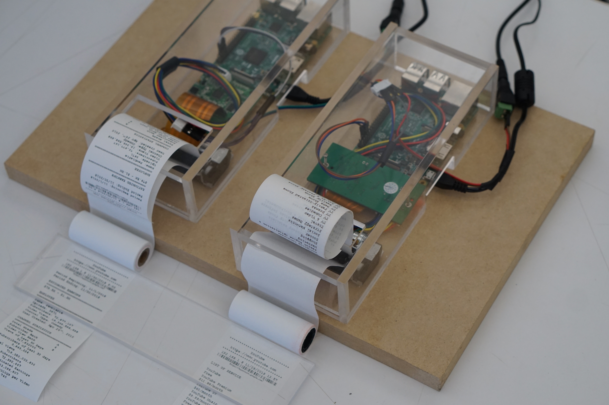

#### Form (pop-up show setup)

#### Process + Mechanics
* Raspberry pi setup
* Thermal printer guts setup
* Laser cutting acrylic board
* Soldering 
* Printer setup
* Networked printer setup

#### User Test Questions
https://goo.gl/forms/8E1ff9dqPh5MRtkb2

#### Reflection
Keywords: time and efforts on YouTube; shopping list; accuracy; real-time; me/anyone

Users, in general, can perceive that the story is about the input and output of the YouTube system, how the algorithm perceives us as a viewer, and how the algorithm processes the data. The Ad profiling coming from Google account setting is the most effective part, as it reflects a reference of self-definition provided by a computer to some extent; however, it is not accurate enough to replace the real self-definition. It is the "digital selfie" as being discussed a lot in some precedents. For the users that are not familiar with the algorithmic analysis of one's digital data, they guess about whether it is a shopping history. People also ask the question about who is providing the data and whether it is a real-time reflection of their online activities. 

